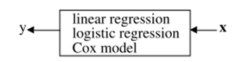

# Statistics and Machine Learning

Machine learning algorithms use computational methods to “learn” information directly from data without assuming a predetermined equation as a model. They can deceptively improve their performance as you increase the number of samples available for learning.

Statistics bases everything on probability models. A typical analysis starts by assuming your data are samples from a random variable with some distribution, then making inferences about the parameters of the distribution. Machine learning may use probability models, and when it does, it overlaps with statistics. But machine learning isn't so committed to probability. It is willing to also use other approaches to problem solving that are not based on probability.

The biggest difference I see between the communities is that statistics emphasizes **inference**, whereas machine learning emphasized **prediction**. When you do statistics, you want to infer the process by which data you have was generated. When you do machine learning, you want to know how you can predict what future data will look like w.r.t. some variable.

For some time, statistics research was conducted in statistics departments while data mining and machine learning research was conducted in computer science departments. Statisticians thought that computer scientists were reinventing the wheel. Computer scientists thought that statistical theory didn’t apply to their problems.

Think of the data as being generated by a black box in which a vector of input variables x \(independent variables\) go in one side, and on the other side the response variables y come out. Inside the black box, nature functions to associate the predictor variables with the response variables, so the picture is like this:

Statistics: The analysis in this culture starts with assuming a stochastic data model for the inside of the black box. For example, a common data model is that data are generated by independent draws from

$$
response variables = f(predictor variables, random noise, parameters)
$$

The values of the parameters are estimated from the data and the model then used for information and/or prediction. Thus the black box is filled in like this:

This enterprise has at its heart the belief that a statistician, by imagination and by looking at the data, can invent a reasonably good parametric class of models for a complex mechanism devised by nature. Then parameters are estimated and conclusions are drawn. ML: The analysis in this culture considers the inside of the box complex and unknown. Their approach is to find a function `f(x)`—an algorithm that operates on `x` to predict the responses y. Their black box looks like this

